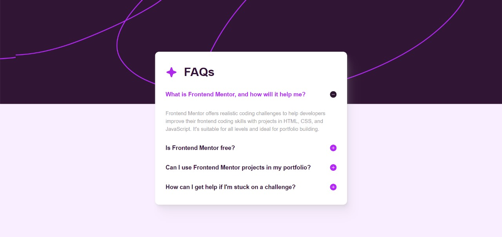

# Frontend Mentor - FAQ accordion solution

This is a solution to the [FAQ accordion challenge on Frontend Mentor](https://www.frontendmentor.io/challenges/faq-accordion-wyfFdeBwBz). Frontend Mentor challenges help you improve your coding skills by building realistic projects. 

## Table of contents

- [Overview](#overview)
  - [The challenge](#the-challenge)
  - [Screenshot](#screenshot)
  - [Links](#links)
- [My process](#my-process)
  - [Built with](#built-with)
  - [What I learned](#what-i-learned)
  - [Useful resources](#useful-resources)
- [Author](#author)

## Overview

### The challenge

Users should be able to:

- Hide/Show the answer to a question when the question is clicked
- Navigate the questions and hide/show answers using keyboard navigation alone
- View the optimal layout for the interface depending on their device's screen size
- See hover and focus states for all interactive elements on the page

### Screenshot

### Links

- Solution URL: [Solution](https://www.frontendmentor.io/solutions/vue-faq-accordion-QHiHyfVARV)
- Live Site URL: [Preview](https://faq-accordion-three-dun.vercel.app/)

## My process

### Built with

- Semantic HTML5 markup
- CSS
- Flexbox
- Mobile-first workflow
- [Vue.js](https://vuejs.org/) - JS library
- [Radix Vue](https://www.radix-vue.com/) - Unstyled, accessible components for building high‑quality web apps in Vue.
- [TailwindCSS](https://tailwindcss.com/) - For styles

### What I learned

In this project, I got to know and learned how to use the Radix Vue library, which is similar to Radix UI in React.js, and it helped me a lot in creating the keyboard-accessible and navigable accordion.

### Useful resources

- [Vue Style Guide](https://v2.vuejs.org/v2/style-guide/) - This helped me with its rules. I really liked the patterns and will use it going forward on my Vue projects.
- [Radix Vue](https://www.radix-vue.com/) - This is an amazing component library which helped me create accessible components. I'd recommend it to anyone still use this library.

## Author

- GitHub - [@rodrigoqueiroz12](https://github.com/rodrigoqueiroz12)
- Frontend Mentor - [@rodrigoqueiroz12](https://www.frontendmentor.io/profile/rodrigoqueiroz12)
- LinkedIn - [@rodrigoqueiroz](www.linkedin.com/in/rodrigo-queiroz-a113a9212)
